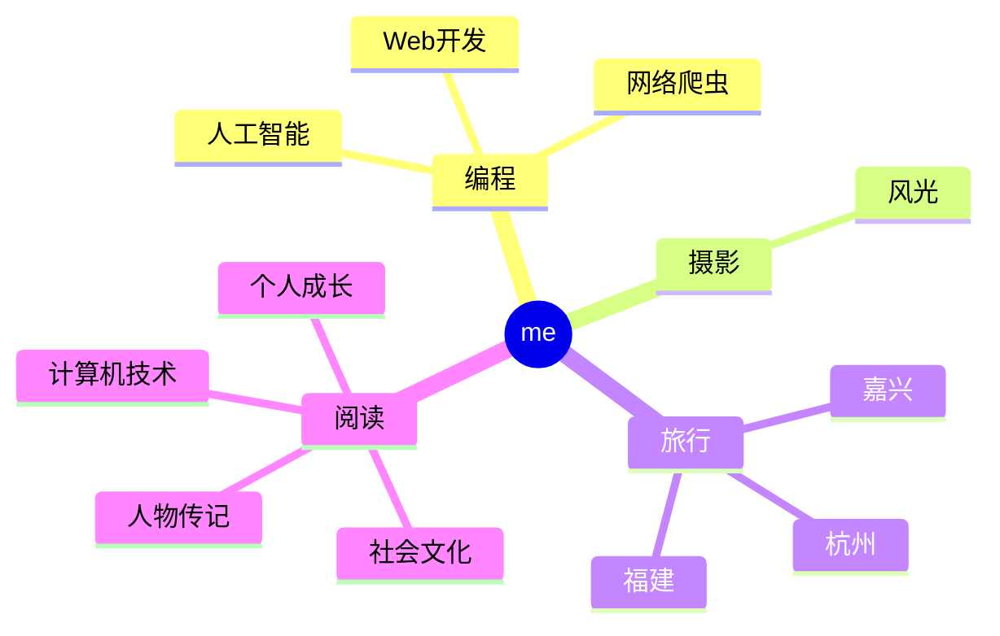

  
  <!-- dynamic typing effect 动态打字效果 -->
  

    
  

  <!-- knock code pictures 敲代码的图片 -->
   

  <!-- profile logo 个人资料徽标 -->
  

    <!-- visitor statistics logo 访问量统计徽标 -->
    
  

<!-- Snake Code Contribution Map 贪吃蛇代码贡献图 -->
<picture>
  <source media="(prefers-color-scheme: dark)" srcset="https://cdn.jsdelivr.net/gh/wmb0412/wmb0412/profile-snake-contrib/github-contribution-grid-snake-dark.svg" />
  <source media="(prefers-color-scheme: light)" srcset="https://cdn.jsdelivr.net/gh/wmb0412/wmb0412/profile-snake-contrib/github-contribution-grid-snake.svg" />
  
</picture>

#  🙋 Hello

<table>
<tr><td>

<!-- About me 关于我 -->
### 🤺 About Me

&emsp;&emsp;热爱编程、摄影、读书、旅行。

&emsp;&emsp;热爱计算机科学和IT互联网事业，励志成为一名优秀的开发者。

&emsp;&emsp;我们正在让这个世界变得更加美好，通过代码的重复使用和延展构建完美体系。

<strong>&emsp;&emsp;We're making the world a better place. Through constructing elegant hierarchies for maximum code reuse and extensibility.</strong>

</td></tr>

</table>

<!-- ########################################## 分割 ########################################## -->

<!-- just img 图片 -->

<!-- profile-3d-contrib 3D贡献图-->

  
<!-- GitHub 奖杯🏆 -->
 

<!-- GitHub 数据统计 -->

  

  

<!-- ########################################## 分割 ########################################## -->

<!-- run 图片 -->

<!-- github-readme-streak-stats 连续提交代码天数记录 -->
&emsp;

&emsp;

<!-- metrics 基础资料 -->
&emsp;
&emsp;

<!-- GitHub Activity Graph GitHub 活动图 -->
<table align="center">
  <tr>
    <td></td>
  </tr>
</table>

<!-- ########################################## 分割 ########################################## -->

<!-- GitHub metrics 信息指标 -->

<!-- just img 图片 -->

